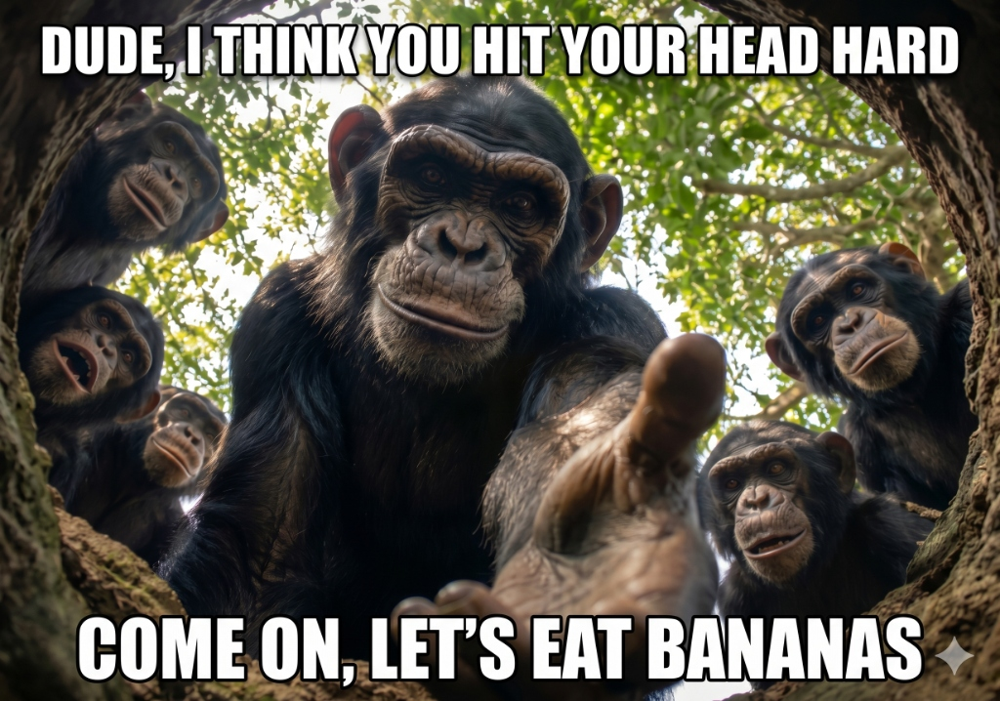

 

  

&nbsp;&nbsp;
&nbsp;&nbsp;
&nbsp;&nbsp;

  
Turkey · Open to collaboration & freelance opportunities

   

<!-- ============================================================ -->
<!--  STATS                                                        -->
<!-- ============================================================ -->

   

<!-- ============================================================ -->
<!--  TECH STACK                                                   -->
<!-- ============================================================ -->

<table>
  <tr>
    <td align="center" width="150"><b>LANGUAGES</b></td>
    <td></td>
  </tr>
  <tr><td colspan="2" height="18"></td></tr>
  <tr>
    <td align="center"><b>PLATFORMS</b></td>
    <td></td>
  </tr>
</table>

   

<!-- ============================================================ -->
<!--  FEATURED PROJECT                                             -->
<!-- ============================================================ -->

   

<!-- ============================================================ -->
<!--  SHOWCASE                                                     -->
<!-- ============================================================ -->

   

<!-- ============================================================ -->
<!--  ACTIVITY                                                     -->
<!-- ============================================================ -->

  

<picture>
  <source media="(prefers-color-scheme: dark)" srcset="https://raw.githubusercontent.com/bercaius/bercaius/output/github-contribution-grid-snake-dark.svg">
  <source media="(prefers-color-scheme: light)" srcset="https://raw.githubusercontent.com/bercaius/bercaius/output/github-contribution-grid-snake.svg">
  
</picture>

   

<!-- ============================================================ -->
<!--  CLOSER                                                       -->
<!-- ============================================================ -->

 

  

